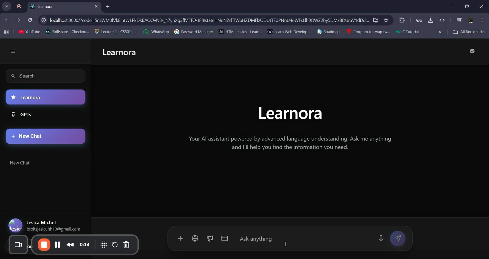
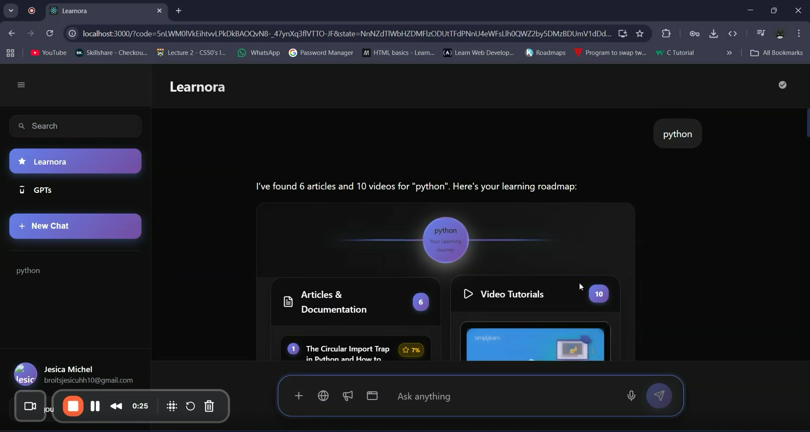
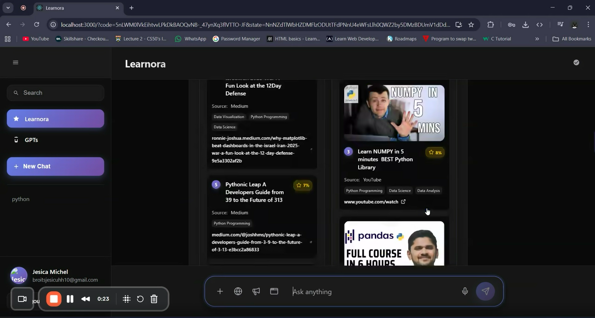

# Learnora — AI-Powered Personalized Learning Engine

<p align="center">
  
</p>

<p align="center">
  <strong>Semantic retrieval + AI-assisted sequencing for personalized learning paths.</strong>
</p>

<p align="center">
  <a href="#why-i-built-learnora">Why Learnora</a> ·
  <a href="#architecture">Architecture</a> ·
  <a href="#engineering-decisions">Engineering decisions</a> ·
  <a href="#run-locally">Run locally</a>
</p>

<p align="center">
  <strong>16K+</strong> learning resources &nbsp;·&nbsp; <strong>4</strong> source platforms &nbsp;·&nbsp; <strong>Semantic</strong> retrieval
</p>

---

## Why I built Learnora

Learning resources are spread across platforms and are rarely organized around the learner's actual goal, background, or prerequisite knowledge. Learnora explores a different approach: retrieve resources by **semantic intent**, then use structured metadata and AI-assisted sequencing to turn those results into a learning path.

The project brings together data ingestion, embedding generation, vector retrieval, backend APIs, AI orchestration, and a React interface instead of treating the recommendation system as a standalone notebook experiment.

## What it does

A learner can enter a goal such as:

> `I want to learn machine learning for sports analytics.`

Learnora then:

1. Encodes the query with a SentenceTransformer model.
2. Searches a persisted FAISS index containing 16,000+ learning resources.
3. Retrieves candidates using semantic similarity rather than simple keyword matching.
4. Uses stored metadata such as difficulty, prerequisites, credibility, content type, source, and labels to enrich the retrieved results.
5. Can pass the retrieved resources and learner profile to Gemini to organize them into learning phases and identify missing prerequisites.
6. Returns structured data for the React application to render as a learning experience.

---

## Product preview

<table>
<tr>
<td width="50%" valign="top">
<strong>Learning interface</strong><br><br>

</td>
<td width="50%" valign="top">
<strong>Semantic retrieval</strong><br><br>

</td>
</tr>
</table>

<p align="center">
  <strong>Generated roadmap</strong><br><br>
  
</p>

---

## Architecture

```text
 Learning Sources
 arXiv · YouTube · Kaggle · Medium
              │
              ▼
      Ingestion & Metadata
              │
              ▼
     SentenceTransformer
        embeddings
              │
              ▼
        FAISS Index
    semantic retrieval
              │
       ┌──────┴──────┐
       ▼             ▼
  Structured      Gemini
   metadata     orchestration
       │             │
       └──────┬──────┘
              ▼
         Flask REST API
              │
              ▼
        React Frontend
```

## How it works

### 1. Semantic retrieval

The backend loads a SentenceTransformer model, encodes the user's query, and searches the persisted FAISS index. Retrieved records are joined with their stored metadata and assigned a similarity score. The retrieval implementation is isolated in the backend so it can be inspected and evolved independently of the UI.

### 2. Structured resource metadata

Learnora stores fields including:

- difficulty level
- prerequisites
- credibility score
- content type
- source
- labels

This gives the application more context than a raw nearest-neighbour result and provides signals for later recommendation and sequencing logic.

### 3. AI-assisted roadmap generation

The AI orchestration layer can pass retrieved resources and a learner profile to Gemini to organize them into remedial, beginner, intermediate, and advanced phases. If missing prerequisites are identified, the system can query an external search API for additional resources.

### 4. Application layer

The Flask backend exposes endpoints for health checks, semantic search, roadmap generation, and fishbone-style roadmap data. The React frontend consumes these APIs and renders the learning experience.

---

## Engineering decisions

### Semantic retrieval instead of keyword matching

Learning queries often express intent rather than exact resource titles. Embedding-based retrieval lets the system compare the meaning of a query with resource representations.

### FAISS for local vector retrieval

The project uses a persisted FAISS index so retrieval can happen locally without recomputing embeddings for the full resource collection on every request.

### Metadata as a first-class data layer

Similarity alone cannot capture useful context such as difficulty, prerequisites, credibility, or content type. Keeping these fields alongside the retrieved resources makes the results inspectable and gives downstream logic more information to work with.

### Retrieval separated from generation

Semantic retrieval and AI-assisted sequencing are separate stages. This makes it possible to inspect the retrieved evidence before asking the LLM to organize it into a learning path.

---

## Key technical components

| Layer | Implementation |
|---|---|
| Frontend | React, React Router, Tailwind CSS |
| Backend | Python, Flask, REST APIs |
| Semantic retrieval | SentenceTransformers, FAISS |
| AI orchestration | Gemini API |
| ML stack | PyTorch, Hugging Face Transformers |
| Data | Structured JSON metadata + vector index |
| Authentication | Auth0 integration in the frontend |

---

## Repository structure

```text
Learnora-AI_Engine/
├── assets/                 # Product and retrieval visuals
├── backend/
│   ├── app.py              # Flask application and REST endpoints
│   ├── inference.py        # SentenceTransformer + FAISS retrieval
│   ├── ai_orchestration.py # LLM-assisted roadmap sequencing
│   ├── roadmap.py          # Roadmap construction
│   ├── datasets/           # Metadata and vector index
│   └── requirements.txt
├── frontend/               # React application
└── README.md
```

---

## API surface

The Flask backend currently exposes endpoints including:

```text
GET /api/health
GET /api/search?q=<query>&k=<top_k>
GET /api/roadmap?q=<query>&k=<top_k>&steps=<max_steps>
GET /api/fishbone?q=<query>&k=<top_k>
```

Example:

```bash
curl "http://localhost:5001/api/search?q=machine%20learning%20for%20sports%20analytics&k=10"
```

---

## Run locally

### Backend

```bash
git clone https://github.com/Advait-19/Learnora-AI_Engine.git
cd Learnora-AI_Engine/backend
pip install -r requirements.txt
python app.py
```

The backend runs on `http://localhost:5001` in the current application configuration.

### Frontend

In a second terminal:

```bash
cd Learnora-AI_Engine/frontend
npm install
npm start
```

The application expects the required model, metadata, vector index, and API credentials to be available in the configured project paths/environment.

---

## What I learned building it

Learnora started as a recommendation-system problem and became an exercise in building an end-to-end AI application. The most useful lessons were around the parts surrounding the model: preparing heterogeneous data, designing metadata, making retrieval inspectable, connecting retrieval to an application API, and handling the practical gap between a model pipeline and a usable product.

---

## Current direction

Potential next steps include:

- adaptive recommendations based on learner feedback
- persistent learner memory
- richer LLM-assisted roadmap refinement
- multimodal resource understanding
- graph-based prerequisite mapping

---

## Author

**Advait Gupta**  
Computer Science Engineering · KIIT

Interested in building practical AI systems across semantic retrieval, recommendation systems, LLM applications, and software engineering.

<p align="center">
  <a href="https://github.com/Advait-19">GitHub</a> ·
  <a href="https://github.com/Advait-19/Learnora-AI_Engine">Learnora repository</a>
</p>
